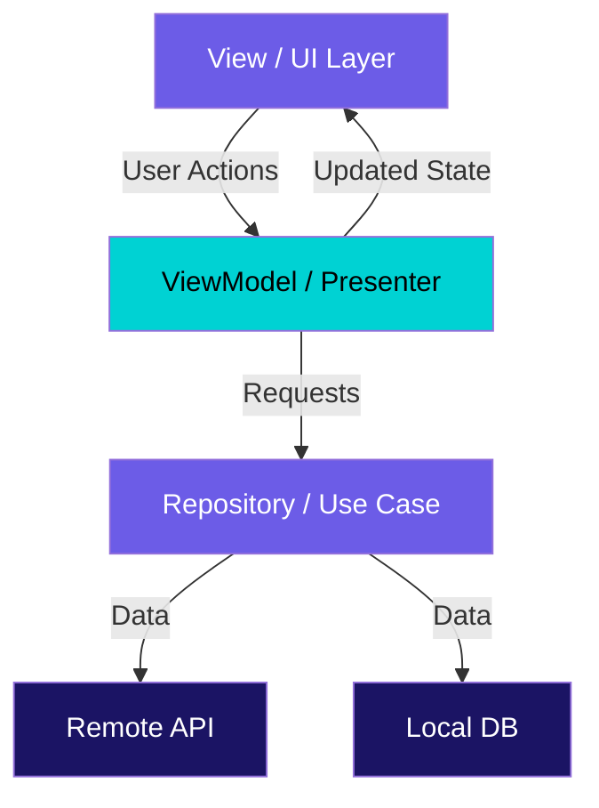
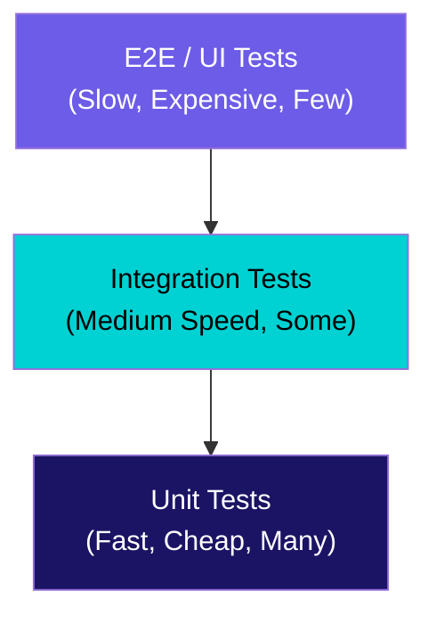

# Mobile Application Development

Key Considerations & Industry Practices

<div class="mt-8 text-lg opacity-70">
Exposure to Emerging Technologies, Practical Applications & Career Insights
</div>

<!--
Welcome everyone! Today we'll explore the world of mobile application development -
from foundational concepts to industry best practices and career opportunities.
This talk is designed for ~1 hour including an interactive hands-on section.
-->

---

# Agenda

<div class="grid grid-cols-2 gap-6 mt-4">

<div>

### Part 1: The Landscape

<div class="mt-2 space-y-2 text-sm">

- Mobile development in 2026
- Native vs Cross-Platform
- iOS, Android & Flutter ecosystems

</div>

### Part 2: Key Considerations

<div class="mt-2 space-y-2 text-sm">

- Architecture patterns (MVVM, MVP, BLoC)
- UI/UX design principles
- State management & networking
- Testing & security

</div>

</div>

<div>

### Part 3: Industry Practices

<div class="mt-2 space-y-2 text-sm">

- CI/CD for mobile
- App Store deployment
- Monitoring & performance

</div>

### Part 4: Hands-On & Careers

<div class="mt-2 space-y-2 text-sm">

- Interactive cookbook walkthrough
- Career roadmap & insights
- Q&A

</div>

</div>

</div>

<!--
Here's our roadmap for today. We'll move from high-level landscape into deep
technical considerations, then industry practices, and close with a hands-on
cookbook and career discussion. Feel free to ask questions anytime.
-->

---

# Learning Goals

<div class="grid grid-cols-3 gap-6 mt-8">

<div v-click class="icon-card text-center">

### Emerging Tech

<div class="text-4xl mt-4 mb-4">🔬</div>

<p class="text-sm opacity-80">Understand the current mobile technology landscape and where it's heading</p>

</div>

<div v-click class="icon-card text-center">

### Practical Apps

<div class="text-4xl mt-4 mb-4">🛠️</div>

<p class="text-sm opacity-80">Learn key considerations & patterns for building production mobile apps</p>

</div>

<div v-click class="icon-card text-center">

### Career Insights

<div class="text-4xl mt-4 mb-4">🚀</div>

<p class="text-sm opacity-80">Discover career paths, skills roadmap, and growth opportunities</p>

</div>

</div>

<!--
Three pillars for today: exposure to what's new, practical hands-on knowledge,
and insights into how to build a career in mobile development.
-->

---

# The Mobile Landscape in 2026

<div class="grid grid-cols-2 gap-8 mt-4">

<div v-click>

## The Numbers

- **6.9 billion** smartphone users worldwide
- **$935 billion** projected app revenue
- **5.7 million** apps across major stores
- **4+ hours** average daily mobile usage
- Mobile accounts for **60%+** of web traffic

</div>

<div v-click>

## What's Trending

- **AI/ML Integration** – on-device inference, smart assistants
- **AR/VR Experiences** – spatial computing, Apple Vision Pro
- **Super Apps** – multi-function platforms
- **5G-Powered Features** – real-time collaboration, streaming
- **Privacy-First Design** – user data protection regulations

</div>

</div>

<div v-click class="highlight-box mt-4 text-center text-sm">
  Mobile is not just a platform — it's the <strong>primary interface</strong> between people and technology.
</div>

<!--
The mobile market is massive and continues to grow. These trends shape what
developers need to learn and what companies are investing in.
-->

---

# Two Dominant Ecosystems

<div class="grid grid-cols-2 gap-8 mt-6">

<div v-click>

<div class="icon-card">

### Apple / iOS

- **Language:** Swift (modern, type-safe)
- **UI Frameworks:** SwiftUI, UIKit
- **IDE:** Xcode
- **Distribution:** App Store
- **Market:** Higher revenue per user, premium segment
- **Key APIs:** Core ML, ARKit, HealthKit, StoreKit

</div>

</div>

<div v-click>

<div class="icon-card">

### Google / Android

- **Language:** Kotlin (concise, interoperable)
- **UI Frameworks:** Jetpack Compose, XML Views
- **IDE:** Android Studio
- **Distribution:** Google Play, sideloading
- **Market:** Larger user base, global reach
- **Key APIs:** ML Kit, ARCore, CameraX, WorkManager

</div>

</div>

</div>

<!--
Both platforms have mature ecosystems. Swift and Kotlin are modern languages that
replaced Objective-C and Java respectively. Both now have declarative UI frameworks.
-->

---

# Native iOS Development

<div class="grid grid-cols-2 gap-6 mt-2">

<div>

### Swift & SwiftUI

```swift
struct ChoreListView: View {
    @StateObject var viewModel = ChoreViewModel()

    var body: some View {
        NavigationStack {
            List(viewModel.chores) { chore in
                ChoreRow(chore: chore)
            }
            .navigationTitle("My Chores")
            .task {
                await viewModel.loadChores()
            }
        }
    }
}
```

<span class="badge badge-ios">SwiftUI</span>
<span class="badge badge-ios">Async/Await</span>
<span class="badge badge-ios">MVVM</span>

</div>

<div v-click>

### Key Patterns We've Used

- **MVVM + Combine** for reactive data flow
- **Structured Concurrency** (async/await)
- **Dependency Injection** for testability
- **XCTest** for unit & UI testing

<div class="accent-box mt-4 text-sm">

**Real Project:** We built a "Tidy" app using MVVM + Combine to manage household chores — demonstrating clean architecture vs a simpler "Unkempt" approach.

</div>

</div>

</div>

<!--
This code is adapted from our iosdemo training project. Notice how SwiftUI's
declarative syntax makes UI code readable. The Tidy vs Unkempt comparison
demonstrated why architecture matters even in small apps.
-->

---

# Native Android Development

<div class="grid grid-cols-2 gap-6 mt-2">

<div>

### Kotlin & Jetpack Compose

```kotlin
@Composable
fun TransferScreen(
    viewModel: TransferViewModel = viewModel()
) {
    val state by viewModel.uiState.collectAsState()

    Column(modifier = Modifier.padding(16.dp)) {
        Text("Bank Transfer",
            style = MaterialTheme.typography.headlineMedium)

        AmountField(value = state.amount,
            onValueChange = viewModel::updateAmount)

        Button(onClick = { viewModel.submit() }) {
            Text("Transfer")
        }
    }
}
```

<span class="badge badge-android">Compose</span>
<span class="badge badge-android">StateFlow</span>
<span class="badge badge-android">MVVM</span>

</div>

<div v-click>

### Key Patterns We've Used

- **MVP → MVVM** migration patterns
- **Activities & Fragments** lifecycle management
- **Retrofit** for network requests
- **Data Binding** for reactive views

<div class="accent-box mt-4 text-sm">

**Real Project:** Our Android cadet training covered a banking app with Activities, Fragments, MVP pattern, and Retrofit for API calls — all fundamental building blocks.

</div>

</div>

</div>

<!--
This is modeled after our android-cadet-training project. Kotlin's conciseness
with Jetpack Compose is analogous to Swift with SwiftUI - both are declarative.
The training covered the full lifecycle from Activities to network calls.
-->

---

# Cross-Platform with Flutter

<div class="grid grid-cols-2 gap-6 mt-2">

<div>

### Dart & Flutter

```dart
class LoginScreen extends StatelessWidget {
  const LoginScreen({super.key});

  @override
  Widget build(BuildContext context) {
    return BlocProvider(
      create: (_) => getIt<LoginBloc>(),
      child: BlocBuilder<LoginBloc, LoginState>(
        builder: (context, state) {
          return Scaffold(
            body: Column(
              children: [
                EmailField(error: state.emailError),
                PasswordField(error: state.passError),
                LoginButton(isLoading: state.isLoading),
              ],
            ),
          );
        },
      ),
    );
  }
}
```

<span class="badge badge-flutter">Flutter</span>
<span class="badge badge-flutter">BLoC</span>
<span class="badge badge-flutter">GetIt DI</span>

</div>

<div v-click>

### Why Flutter?

- **Single codebase** for iOS, Android, Web, Desktop
- **Hot Reload** for rapid development
- **Widget-based** composable UI system
- **Growing ecosystem** and community

<div class="accent-box mt-4 text-sm">

**Real Project:** Our CadetBank app uses Flutter + BLoC pattern with login, registration, and collection screens — demonstrating clean state management with GetIt for dependency injection.

</div>

</div>

</div>

<!--
The CadetBank project from our training is a great example. BLoC separates business
logic from UI, GetIt handles dependency injection, and Freezed generates immutable
state classes. One codebase, two platforms.
-->

---

# Native vs Cross-Platform: The Decision Matrix

<div class="mt-4">

| Factor | Native (iOS/Android) | Cross-Platform (Flutter/RN) |
|---|---|---|
| **Performance** | Best-in-class | Near-native (95%+) |
| **Platform APIs** | Full access, day-1 support | Plugin-dependent, slight lag |
| **Dev Speed** | Slower (2 codebases) | Faster (shared codebase) |
| **Team Size** | Larger (specialized) | Smaller (shared skills) |
| **UI Fidelity** | Pixel-perfect platform feel | Consistent cross-platform |
| **Cost** | Higher | Lower |
| **Maintenance** | Two separate apps | Single codebase |

</div>

<div v-click class="highlight-box mt-4 text-sm">

**Industry Insight:** Many companies use a <strong>hybrid approach</strong> — cross-platform for most features, native modules for performance-critical or platform-specific functionality.

</div>

<!--
There's no universal "best" choice. The answer depends on your team, budget,
timeline, and app requirements. Many successful companies use both approaches.
-->

---

# Other Cross-Platform Options Worth Knowing

<div class="grid grid-cols-3 gap-4 mt-6">

<div v-click class="icon-card">

### React Native

- JavaScript / TypeScript
- Large community
- Meta-backed
- Bridge to native modules
- Used by: Instagram, Shopify

</div>

<div v-click class="icon-card">

### Kotlin Multiplatform

- Shared Kotlin business logic
- Native UI per platform
- JetBrains-backed
- Growing adoption
- Used by: Netflix, VMWare

</div>

<div v-click class="icon-card">

### .NET MAUI

- C# / .NET
- Microsoft ecosystem
- Evolved from Xamarin
- Desktop + Mobile
- Used by: UPS, NBC Sports

</div>

</div>

<div v-click class="mt-6 text-center text-sm opacity-70">

The cross-platform space is maturing rapidly — all options produce production-quality apps in 2026.

</div>

<!--
React Native is the most established. KMP is interesting because you share logic
but keep native UI. MAUI is great for teams already in the .NET ecosystem.
-->

---
layout: section
---

# Part 2: Key Considerations

Architecture, UI/UX, Testing & Security

<!--
Now let's dive into the technical considerations that separate hobby projects
from production-grade mobile applications.
-->

---

# Architecture Patterns

<div class="grid grid-cols-2 gap-6 mt-2">

<div>

### Why Architecture Matters

<div v-click class="mb-4">

Without architecture:
- Code becomes tangled ("Big ViewController")
- Testing is painful or impossible
- Onboarding new developers takes forever
- Bugs are hard to trace

</div>

<div v-click>

With architecture:
- Clear separation of concerns
- Easy to test each layer
- Teams can work in parallel
- Predictable data flow

</div>

</div>

<div>

<div class="diagram-container">



</div>

<div class="text-center text-sm mt-2 opacity-70">Clean Architecture Layers</div>

</div>

</div>

<!--
Architecture is the skeleton of your app. We saw this clearly in the Tidy vs
Unkempt comparison — the "Tidy" app with proper MVVM was much easier to test
and extend compared to the simpler "Unkempt" approach.
-->

---

# Popular Mobile Architecture Patterns

<div class="grid grid-cols-3 gap-4 mt-4">

<div v-click class="icon-card">

### MVVM

**Model-View-ViewModel**

- View observes ViewModel state
- ViewModel transforms Model data
- Two-way data binding
- Popular on iOS (SwiftUI) & Android (Compose)

```
View ↔ ViewModel → Model
```

</div>

<div v-click class="icon-card">

### MVP

**Model-View-Presenter**

- Presenter holds UI logic
- View is passive (interface)
- Easier to unit test Presenter
- Common in legacy Android

```
View ↔ Presenter → Model
```

</div>

<div v-click class="icon-card">

### BLoC

**Business Logic Component**

- Events in, States out
- Stream-based reactive pattern
- Flutter's recommended pattern
- Clear unidirectional flow

```
Event → BLoC → State → UI
```

</div>

</div>

<div v-click class="highlight-box mt-4 text-sm">

**From our training:** We used <strong>MVVM + Combine</strong> for iOS (Tidy), <strong>MVP</strong> for Android (CadetTraining), and <strong>BLoC</strong> for Flutter (CadetBank) — real examples of each pattern.

</div>

<!--
Each pattern has its place. The important thing is consistency within a project.
Our training projects demonstrate all three in practice.
-->

---

# UI/UX Key Considerations

<div class="grid grid-cols-2 gap-6 mt-4">

<div>

<div v-click>

### Platform Design Guidelines

- **iOS:** Human Interface Guidelines (HIG)
- **Android:** Material Design 3
- Users expect platform-native interactions
- Respect platform navigation patterns

</div>

<div v-click class="mt-4">

### Responsive Design

- Phones, tablets, foldables
- Dynamic type / font scaling
- Dark mode support
- Landscape & portrait orientations

</div>

</div>

<div>

<div v-click>

### Accessibility (a11y)

- VoiceOver / TalkBack support
- Sufficient color contrast (4.5:1 ratio)
- Touch targets ≥ 44pt (iOS) / 48dp (Android)
- Semantic labels for screen readers

</div>

<div v-click>

### Performance UX

- Skeleton screens over spinners
- Optimistic updates
- Offline-first with graceful degradation
- Smooth 60fps animations

</div>

</div>

</div>

<!--
Great UX is invisible — users only notice when something is wrong. Following
platform guidelines means your app feels "at home" on each platform.
Accessibility is not optional; it's a requirement for many enterprise apps.
-->

---

# State Management

<div class="mt-2">

### The Core Challenge

Every mobile app must decide: **where does state live, how does it change, and who gets notified?**

</div>

<div class="grid grid-cols-3 gap-4 mt-4">

<div v-click class="icon-card text-sm">

### iOS

- **@State / @Binding** – local view state
- **@StateObject / @ObservedObject** – shared state
- **Combine** – reactive streams
- **@EnvironmentObject** – dependency injection

</div>

<div v-click class="icon-card text-sm">

### Android

- **State\<T\>** / **MutableState** – Compose state
- **StateFlow / SharedFlow** – coroutine streams
- **ViewModel** – survives config changes
- **SavedStateHandle** – process death

</div>

<div v-click class="icon-card text-sm">

### Flutter

- **setState** – simple local state
- **BLoC / Cubit** – event-driven state
- **Provider / Riverpod** – dependency injection
- **Freezed** – immutable state classes

</div>

</div>

<div v-click class="highlight-box mt-4 text-sm">

**Rule of thumb:** Local UI state stays in the view. Shared business state lives in a ViewModel/BLoC. App-wide state uses DI containers.

</div>

<!--
State management is often the #1 source of bugs in mobile apps. Choosing the
right tool for each level of state is critical. Our CadetBank Flutter project
used BLoC + Freezed for predictable, immutable state management.
-->

---

# Networking & API Integration

<div class="grid grid-cols-2 gap-6 mt-4">

<div>

### Common Patterns

<div v-click>

- **REST APIs** – standard CRUD operations
- **GraphQL** – flexible client-driven queries
- **gRPC** – high-performance binary protocol
- **WebSockets** – real-time bidirectional

</div>

<div v-click class="mt-4">

### Best Practices

- Define clear API contracts (OpenAPI/Swagger)
- Use code generation for models
- Implement retry logic & exponential backoff
- Cache responses appropriately
- Handle offline scenarios

</div>

</div>

<div v-click>

### Libraries by Platform

| Platform | HTTP Client | Serialization |
|---|---|---|
| **iOS** | URLSession, Alamofire | Codable |
| **Android** | Retrofit, Ktor | Moshi, Kotlinx |
| **Flutter** | Dio, http | json_serializable |

<div class="accent-box mt-4 text-sm">

**From our training:** Our Android CadetTraining used <strong>Retrofit</strong> for API calls. The Flutter CadetBank used <strong>Dio</strong> with Retrofit-style code generation. We also built OpenAPI specs for contract-first development.

</div>

</div>

</div>

<!--
Networking is the bridge between your app and the backend. The OpenAPI project
in our training showed how to define contracts first — both mobile and backend
teams can work in parallel with a shared spec.
-->

---

# Testing Strategies

<div class="mt-2">

### The Testing Pyramid for Mobile

</div>

<div class="diagram-container mt-2">



</div>

<div class="grid grid-cols-3 gap-4 mt-4">

<div v-click class="text-sm">

### Unit Tests

- Test ViewModels, BLoCs, Use Cases
- Mock dependencies
- Fast feedback loop
- **Tools:** XCTest, JUnit, flutter_test

</div>

<div v-click class="text-sm">

### Integration Tests

- Test feature workflows
- Real or fake services
- Database + network layer
- **Tools:** XCTest, Espresso, integration_test

</div>

<div v-click class="text-sm">

### E2E / UI Tests

- Full user journeys
- Run on device/simulator
- Screenshot testing
- **Tools:** XCUITest, Maestro, Appium

</div>

</div>

<!--
From our iosdemo training, we practiced testing ViewModels with mocked
dependencies. The pytest-demo and jest-demo projects showed testing
fundamentals that apply across platforms — mocking, fixtures, assertions.
-->

---

# Security Best Practices

<div class="grid grid-cols-2 gap-6 mt-4">

<div>

<div v-click>

### Data Protection

- Encrypt sensitive data at rest (Keychain / EncryptedSharedPreferences)
- Use HTTPS/TLS for all network calls
- Certificate pinning for critical endpoints
- Never store secrets in code or git

</div>

<div v-click class="mt-4">

### Authentication

- OAuth 2.0 / OpenID Connect
- Biometric authentication (Face ID, fingerprint)
- Secure token storage & refresh flows
- Session timeout policies

</div>

</div>

<div>

<div v-click>

### Code Security

- Enable code obfuscation (ProGuard / R8)
- Detect jailbreak/root for sensitive apps
- Validate all user input
- Keep dependencies updated (supply chain)

</div>

<div v-click>

### Compliance

- **GDPR** – EU data protection
- **CCPA** – California privacy
- **HIPAA** – healthcare apps
- **PCI DSS** – payment processing
- App Store privacy nutrition labels

</div>

</div>

</div>

<!--
Security is non-negotiable in production apps. Many of these practices are
required for enterprise app store approvals. The CadetBank login flow is a
good starting point for understanding auth flows.
-->

---
layout: section
---

# Part 3: Industry Practices

How Teams Ship Mobile Apps at Scale

<!--
Let's move from "what" to "how" — the practices that make mobile development
sustainable in professional teams.
-->

---

# CI/CD for Mobile Apps

<div class="grid grid-cols-2 gap-6 mt-2">

<div>

### Pipeline Stages

<div class="text-sm mt-2">

```
Code Push  →  Lint & Format
                  ↓
             Unit Tests
                  ↓
               Build
                  ↓
          Integration Tests
                  ↓
           Sign & Archive
                  ↓
        Deploy to TestFlight
         / Internal Track
```

</div>

</div>

<div>

<div v-click>

### CI/CD Tools

- **Fastlane** – automate build, test, deploy
- **GitHub Actions** / **GitLab CI** – pipeline orchestration
- **Bitrise / Codemagic** – mobile-specialized CI
- **Firebase App Distribution** – beta testing
- **TestFlight** – iOS beta distribution

</div>

<div v-click class="accent-box mt-4 text-sm">

**From our training:** The GitLab CI/CD Pipelines presentation covered reusable templates, stages, and hands-on workshop for building pipelines — these same concepts apply to mobile CI/CD.

</div>

</div>

</div>

<!--
CI/CD is essential for mobile teams. Our GitLab CI/CD training covered pipeline
fundamentals that directly apply — stages, jobs, artifacts, and deployment.
Fastlane is the de facto standard for mobile build automation.
-->

---

# App Store & Deployment

<div class="grid grid-cols-2 gap-6 mt-4">

<div v-click>

### The Release Process

<div class="timeline-item">
  <strong>Version & Build Numbers</strong><br/>
  <span class="text-sm opacity-80">Semantic versioning, incremental builds</span>
</div>
<div class="timeline-item">
  <strong>Code Signing & Provisioning</strong><br/>
  <span class="text-sm opacity-80">Certificates, profiles, keystore management</span>
</div>
<div class="timeline-item">
  <strong>App Store Review</strong><br/>
  <span class="text-sm opacity-80">Guidelines compliance, metadata, screenshots</span>
</div>
<div class="timeline-item">
  <strong>Phased Rollout</strong><br/>
  <span class="text-sm opacity-80">Progressive delivery: 1% → 10% → 50% → 100%</span>
</div>
<div class="timeline-item">
  <strong>Post-Release Monitoring</strong><br/>
  <span class="text-sm opacity-80">Crash rates, user feedback, analytics</span>
</div>

</div>

<div v-click>

### Things That Can Go Wrong

- Rejected by App Store review
- Signing certificate expired
- Missing privacy declarations
- Crash spike on specific device/OS
- Critical bug found post-release

### Mitigation

- Automated pre-submission checks
- Certificate rotation reminders
- Feature flags for kill switches
- Staged rollouts with monitoring
- Over-the-air (OTA) update support

</div>

</div>

<!--
Deployment is where many teams struggle. Code signing alone has caused countless
hours of debugging. Phased rollouts are similar to the progressive delivery
concepts we covered in our Istio/Flagger training.
-->

---

# Monitoring & Performance

<div class="grid grid-cols-2 gap-6 mt-4">

<div v-click>

### Key Metrics to Track

- **Crash-free rate** – target 99.9%+
- **App launch time** – cold start < 2s
- **Frame rate** – consistent 60fps
- **Memory usage** – avoid OOM kills
- **Network latency** – API response times
- **Battery impact** – background processing
- **App size** – download & install size

</div>

<div v-click>

### Monitoring Tools

| Category | Tools |
|---|---|
| **Crash Reporting** | Firebase Crashlytics, Sentry |
| **Analytics** | Firebase Analytics, Mixpanel |
| **Performance** | Firebase Performance, Datadog |
| **A/B Testing** | Firebase Remote Config, LaunchDarkly |
| **User Feedback** | App Store reviews, in-app surveys |

<div class="accent-box mt-4 text-sm">

The **SRE mindset** applies to mobile too — define SLOs for crash rate, latency, and user experience metrics.

</div>

</div>

</div>

<!--
Monitoring doesn't stop at backend. Mobile apps need the same observability.
The SRE training concepts — SLOs, error budgets, monitoring — all translate
to mobile app health tracking.
-->

---
layout: section
---

# Part 4: Hands-On Cookbook

Let's Build Something Together!

<!--
Time for the fun part! We'll walk through building a simple Flutter app
together to put these concepts into practice.
-->

---

# Cookbook: Flutter Counter App with BLoC

<div class="grid grid-cols-2 gap-6 mt-2">

<div>

### What We'll Build

A simple counter app demonstrating:
- **BLoC pattern** for state management
- **Events** and **States** separation
- **Clean architecture** structure
- Testing fundamentals

### Prerequisites

```bash
# Install Flutter
# https://docs.flutter.dev/get-started/install

# Verify installation
flutter doctor

# Create project
flutter create bloc_counter_app
cd bloc_counter_app
```

</div>

<div>

### Project Structure

```
bloc_counter_app/
├── lib/
│   ├── main.dart
│   ├── bloc/
│   │   ├── counter_bloc.dart
│   │   ├── counter_event.dart
│   │   └── counter_state.dart
│   └── screens/
│       └── counter_screen.dart
├── test/
│   └── bloc/
│       └── counter_bloc_test.dart
└── pubspec.yaml
```

<div class="highlight-box mt-4 text-sm">

This structure mirrors our <strong>CadetBank</strong> project's approach — a clear separation of BLoC, screens, and core modules.

</div>

</div>

</div>

<!--
This is a simplified version of what we built in the CadetBank training.
We'll walk through each file step by step.
-->

---

# Cookbook Step 1: Define Events & States

<div class="grid grid-cols-2 gap-6 mt-2">

<div>

### Events (What Happened)

```dart
// lib/bloc/counter_event.dart

abstract class CounterEvent {}

class IncrementPressed extends CounterEvent {}

class DecrementPressed extends CounterEvent {}

class ResetPressed extends CounterEvent {}
```

<div class="text-sm mt-2 opacity-80">
Events are <strong>inputs</strong> — user actions or system triggers that tell the BLoC what happened.
</div>

</div>

<div>

### States (What to Show)

```dart
// lib/bloc/counter_state.dart

class CounterState {
  final int count;
  final DateTime lastUpdated;

  const CounterState({
    this.count = 0,
    required this.lastUpdated,
  });

  CounterState copyWith({int? count}) {
    return CounterState(
      count: count ?? this.count,
      lastUpdated: DateTime.now(),
    );
  }
}
```

<div class="text-sm mt-2 opacity-80">
States are <strong>outputs</strong> — immutable snapshots of the data the UI needs to render.
</div>

</div>

</div>

<!--
This is the foundation of BLoC: Events go IN, States come OUT. The copyWith
pattern creates new immutable state objects — similar to Freezed in CadetBank.
-->

---

# Cookbook Step 2: Build the BLoC

```dart
// lib/bloc/counter_bloc.dart

import 'package:flutter_bloc/flutter_bloc.dart';
import 'counter_event.dart';
import 'counter_state.dart';

class CounterBloc extends Bloc<CounterEvent, CounterState> {
  CounterBloc() : super(CounterState(lastUpdated: DateTime.now())) {
    on<IncrementPressed>((event, emit) {
      emit(state.copyWith(count: state.count + 1));
    });

    on<DecrementPressed>((event, emit) {
      if (state.count > 0) {
        emit(state.copyWith(count: state.count - 1));
      }
    });

    on<ResetPressed>((event, emit) {
      emit(state.copyWith(count: 0));
    });
  }
}
```

<div class="highlight-box mt-4 text-sm">

**Pattern:** Each event handler is a pure function — given the current state and an event, it produces a new state. This makes logic <strong>predictable and testable</strong>.

</div>

<!--
The BLoC itself is just a mapping from events to states. No UI code, no
framework dependencies beyond flutter_bloc. This is what makes it so testable.
-->

---

# Cookbook Step 3: Create the UI

<div class="grid grid-cols-2 gap-4 mt-1">

<div>

```dart
// lib/screens/counter_screen.dart
class CounterScreen extends StatelessWidget {
  const CounterScreen({super.key});

  @override
  Widget build(BuildContext context) {
    return Scaffold(
      appBar: AppBar(
        title: const Text('BLoC Counter'),
        actions: [
          IconButton(icon: const Icon(Icons.refresh),
            onPressed: () => context
              .read<CounterBloc>()
              .add(ResetPressed())),
        ]),
```

</div>

<div>

```dart
      body: Center(
        child: BlocBuilder<CounterBloc, CounterState>(
          builder: (context, state) {
            return Text('${state.count}',
              style: Theme.of(context)
                .textTheme.displayLarge);
          },
        ),
      ),
      floatingActionButton: Column(
        mainAxisSize: MainAxisSize.min,
        children: [
          FloatingActionButton(heroTag: 'inc',
            child: const Icon(Icons.add),
            onPressed: () => context
              .read<CounterBloc>()
              .add(IncrementPressed())),
          const SizedBox(height: 8),
          FloatingActionButton(heroTag: 'dec',
            child: const Icon(Icons.remove),
            onPressed: () => context
              .read<CounterBloc>()
              .add(DecrementPressed())),
      ]));}}
```

</div>

</div>

<div class="highlight-box mt-2 text-sm">

The UI has **zero business logic** — it reads state via `BlocBuilder` and dispatches events via `context.read<CounterBloc>().add(...)`.

</div>

<!--
The UI just reads state and dispatches events. It has zero business logic.
BlocBuilder rebuilds only when state changes. Clean separation!
-->

---

# Cookbook Step 4: Wire It Up & Test

<div class="grid grid-cols-2 gap-4 mt-1">

<div>

### main.dart

```dart
// lib/main.dart
void main() => runApp(const MyApp());

class MyApp extends StatelessWidget {
  const MyApp({super.key});

  @override
  Widget build(BuildContext context) {
    return MaterialApp(
      title: 'BLoC Counter',
      theme: ThemeData(
        colorSchemeSeed: Colors.deepPurple,
        useMaterial3: true),
      home: BlocProvider(
        create: (_) => CounterBloc(),
        child: const CounterScreen()),
    );
  }
}
```

</div>

<div>

### Unit Test

```dart
// test/bloc/counter_bloc_test.dart
void main() {
  group('CounterBloc', () {
    blocTest<CounterBloc, CounterState>(
      'emits [1] when IncrementPressed',
      build: () => CounterBloc(),
      act: (b) => b.add(IncrementPressed()),
      verify: (b) =>
        expect(b.state.count, equals(1)),
    );

    blocTest<CounterBloc, CounterState>(
      'stays 0 when DecrementPressed at 0',
      build: () => CounterBloc(),
      act: (b) => b.add(DecrementPressed()),
      verify: (b) =>
        expect(b.state.count, equals(0)),
    );
  });
}
```

</div>

</div>

<div class="highlight-box mt-2 text-sm">

`BlocProvider` injects the BLoC into the widget tree. Tests use `bloc_test` — **no UI dependencies needed**.

</div>

<!--
BlocProvider injects the BLoC into the widget tree. The test uses bloc_test
package — notice how we test the BLoC without any UI dependencies at all.
This is the power of clean architecture.
-->

---

# Cookbook: Dependencies & Run

<div class="grid grid-cols-2 gap-4 mt-2">

<div>

### pubspec.yaml

```yaml
dependencies:
  flutter:
    sdk: flutter
  flutter_bloc: ^8.1.6

dev_dependencies:
  flutter_test:
    sdk: flutter
  bloc_test: ^9.1.7
```

### Run It

```bash
flutter pub get    # Install deps
flutter run        # Launch the app
flutter test       # Run tests
```

</div>

<div>

### Challenge for the Audience

Try extending this app:

<div class="icon-card mt-2 text-sm">

**1. Multiply button** — add a `MultiplyPressed` event that doubles the count

</div>

<div class="icon-card mt-2 text-sm">

**2. History list** — track each operation in the state and display it

</div>

<div class="icon-card mt-2 text-sm">

**3. Persistence** — save count to `SharedPreferences` and restore on app start

</div>

</div>

</div>

<!--
These challenges mirror real-world patterns. Persistence especially is something
every production app needs. The CadetBank project handles similar patterns
with its login state and user data.
-->

---
layout: section
---

# Career Insights

Building Your Path in Mobile Development

<!--
Let's talk about what this means for your career and how to position
yourself in the mobile development space.
-->

---

# Mobile Developer Roadmap

<div class="grid grid-cols-2 gap-6 mt-2">

<div>

### Foundation Skills

<div class="timeline-item">
  <strong>Programming Language</strong><br/>
  <span class="text-sm opacity-80">Swift, Kotlin, or Dart — pick one and go deep</span>
</div>
<div class="timeline-item">
  <strong>Platform Fundamentals</strong><br/>
  <span class="text-sm opacity-80">Lifecycle, navigation, storage, networking</span>
</div>
<div class="timeline-item">
  <strong>UI Framework</strong><br/>
  <span class="text-sm opacity-80">SwiftUI, Jetpack Compose, or Flutter widgets</span>
</div>
<div class="timeline-item">
  <strong>Architecture & Patterns</strong><br/>
  <span class="text-sm opacity-80">MVVM, clean architecture, dependency injection</span>
</div>
<div class="timeline-item">
  <strong>Testing & CI/CD</strong><br/>
  <span class="text-sm opacity-80">Unit tests, UI tests, automated pipelines</span>
</div>

</div>

<div v-click>

### Advanced Skills

<div class="timeline-item">
  <strong>Performance Optimization</strong><br/>
  <span class="text-sm opacity-80">Profiling, memory management, rendering</span>
</div>
<div class="timeline-item">
  <strong>Security & Compliance</strong><br/>
  <span class="text-sm opacity-80">Encryption, auth flows, privacy regulations</span>
</div>
<div class="timeline-item">
  <strong>Platform Integration</strong><br/>
  <span class="text-sm opacity-80">Widgets, notifications, health APIs, payments</span>
</div>
<div class="timeline-item">
  <strong>AI/ML on Device</strong><br/>
  <span class="text-sm opacity-80">Core ML, ML Kit, TensorFlow Lite</span>
</div>
<div class="timeline-item">
  <strong>Leadership & Mentoring</strong><br/>
  <span class="text-sm opacity-80">Code reviews, architecture decisions, team growth</span>
</div>

</div>

</div>

<!--
You don't need to learn everything at once. Pick a platform, build depth,
then expand. The training materials we've covered touch on many of these
skills — from Swift basics to CI/CD pipelines.
-->

---

# Career Paths in Mobile

<div class="grid grid-cols-3 gap-4 mt-6">

<div v-click class="icon-card text-center">

### Mobile Developer

<div class="text-3xl mt-2 mb-2">📱</div>

Build features, write tests, ship apps

<div class="text-sm opacity-70 mt-2">Entry → Mid Level</div>

</div>

<div v-click class="icon-card text-center">

### Mobile Tech Lead

<div class="text-3xl mt-2 mb-2">🏗️</div>

Architecture, code reviews, mentoring

<div class="text-sm opacity-70 mt-2">Senior Level</div>

</div>

<div v-click class="icon-card text-center">

### Mobile Architect

<div class="text-3xl mt-2 mb-2">🌐</div>

Cross-team standards, platform strategy

<div class="text-sm opacity-70 mt-2">Staff+ Level</div>

</div>

</div>

<div v-click class="highlight-box mt-6 text-sm">

### Tips for Growth

- **Build portfolio projects** — open source contributions count
- **Learn the "other" platform** — iOS dev? Learn some Android, and vice versa
- **Understand backend** — APIs, databases, cloud services
- **Stay current** — WWDC, Google I/O, Flutter conferences
- **Write about what you learn** — blogs, talks, internal tech shares

</div>

<!--
The mobile space has strong demand and clear growth paths. Cross-platform
knowledge makes you especially valuable. This seminar itself is an example
of tech sharing — a great career accelerator.
-->

---

# Key Takeaways

<div class="grid grid-cols-2 gap-4 mt-4">

<div v-click class="icon-card">

**1. Choose Wisely, Build Deeply** — Pick your platform based on real requirements, not hype.

</div>

<div v-click class="icon-card">

**2. Architecture is Investment** — Clean architecture pays dividends in testability and team velocity.

</div>

<div v-click class="icon-card">

**3. Test What Matters** — Focus on business logic. Automate CI/CD. Don't ship untested code.

</div>

<div v-click class="icon-card">

**4. Security is Non-Negotiable** — Encrypt data, validate inputs, use secure auth.

</div>

<div v-click class="icon-card">

**5. Ship Incrementally** — Phased rollouts, feature flags, and monitoring. Shipping is just the beginning.

</div>

<div v-click class="icon-card">

**6. Never Stop Learning** — Conferences, courses, side projects, and knowledge sharing keep you sharp.

</div>

</div>

<!--
These six principles will serve you well regardless of which platform or
framework you choose. They're the common thread across all our training materials.
-->

---

# Resources to Explore

<div class="grid grid-cols-2 gap-6 mt-4">

<div>

### Official Documentation

- [Swift / SwiftUI](https://developer.apple.com/documentation/swiftui)
- [Kotlin / Jetpack Compose](https://developer.android.com/jetpack/compose)
- [Flutter / Dart](https://docs.flutter.dev)
- [React Native](https://reactnative.dev)

### Learning Platforms

- Apple Developer Tutorials
- Android Developer Codelabs
- Flutter Codelabs
- Ray Wenderlich / Kodeco

</div>

<div>

### Conferences & Events

- **WWDC** – Apple (June)
- **Google I/O** – Android (May)
- **Flutter Forward** – Flutter (varies)
- **KotlinConf** – Kotlin (May)
- **App Builders** – Cross-platform (May)

### Communities

- Stack Overflow
- Reddit: r/iOSProgramming, r/androiddev, r/FlutterDev
- Discord communities
- Local meetup groups

</div>

</div>

<!--
All of these are free or low-cost resources. The best way to learn is to
build something — even a small side project teaches more than just reading.
-->

---
layout: center
class: text-center
---

# Thank You!

<div class="mt-4 text-xl opacity-80">
Mobile Application Development — Key Considerations & Industry Practices
</div>

<div class="mt-8">

### Let's Discuss!

Questions, ideas, or topics you'd like to explore further?

</div>


<!--
Thank you for your time and attention! I hope this gave you a solid foundation
for understanding mobile development. Happy to answer any questions.
The cookbook materials are available for you to try on your own.
-->
