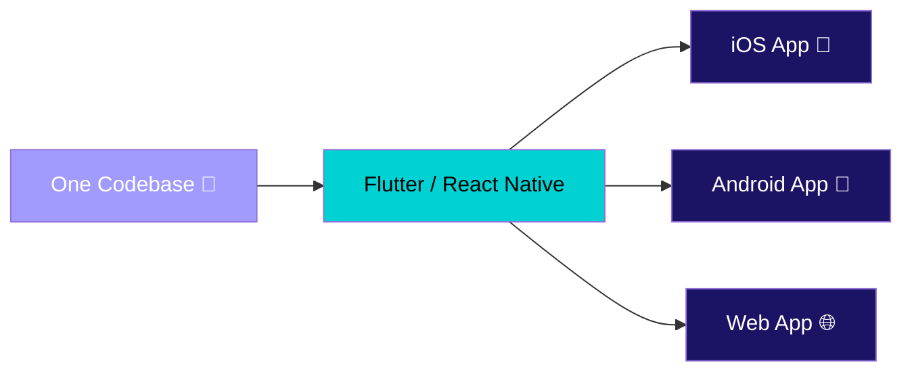
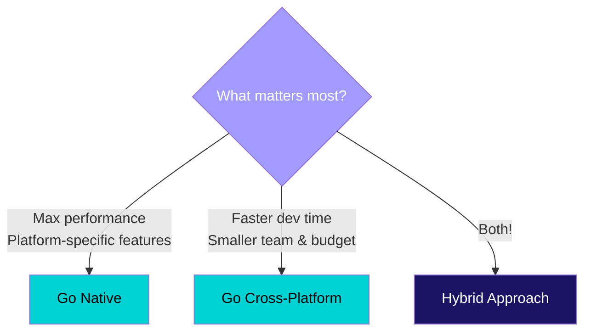
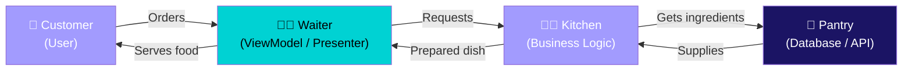
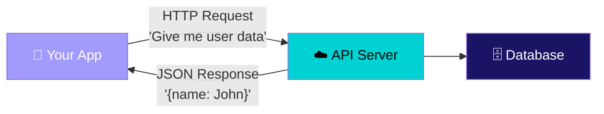
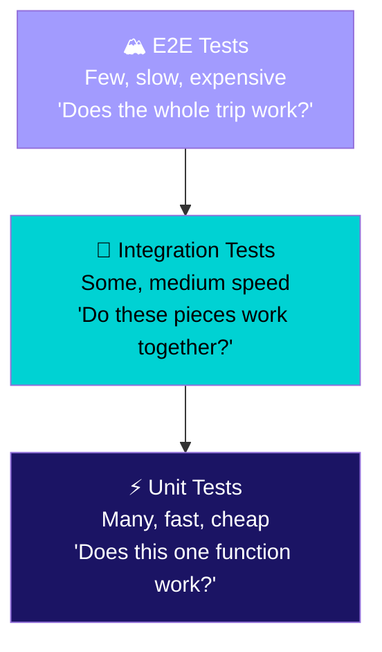
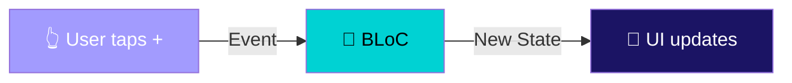
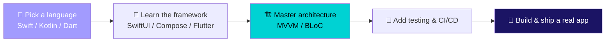

# Building Apps People Love

Key Considerations & Industry Practices

<div class="mt-12 text-lg opacity-60">
A seminar on building apps people actually love using
</div>

<!--
Welcome! Today's talk is designed to be approachable — we'll use analogies
and visuals to make mobile development concepts click.
-->

---

# What We'll Cover

<div class="grid grid-cols-2 gap-12 mt-8">

<div>

### The Journey

1. Why mobile matters
2. Picking your tools
3. Building it right
4. Shipping it safely

</div>

<div>

### The Outcome

- See the big picture of mobile dev
- Understand key decisions teams face
- Get hands-on with a mini project
- Know where to go from here

</div>

</div>

<!--
Think of this as a roadmap. We'll go from "why" to "how" to "what's next."
-->

---

# Mobile is Everywhere

<div class="mt-6 text-center">

### Think about your last hour...

</div>

<div class="grid grid-cols-4 gap-4 mt-8 text-center">

<div v-click class="icon-card">
<div class="text-4xl mb-2">⏰</div>
Alarm clock
</div>

<div v-click class="icon-card">
<div class="text-4xl mb-2">💬</div>
Messaging
</div>

<div v-click class="icon-card">
<div class="text-4xl mb-2">🗺️</div>
Navigation
</div>

<div v-click class="icon-card">
<div class="text-4xl mb-2">💳</div>
Payment
</div>

</div>

<div v-click class="highlight-box mt-8 text-center">

**6.9 billion** smartphone users &bull; **4+ hours** daily screen time &bull; **60%** of web traffic is mobile

</div>

<!--
You probably used 5+ apps before arriving here today. That's the reach of mobile development.
-->

---

# Two Worlds, One Goal

<div class="mt-4 text-center text-sm opacity-70">Mobile development is like car manufacturing — two major factories, same purpose</div>

<div class="grid grid-cols-2 gap-8 mt-6">

<div v-click class="icon-card text-center">

<div class="text-5xl mb-4">🍎</div>

### Apple / iOS

Swift language &bull; SwiftUI framework

Xcode IDE &bull; App Store

*Premium feel, higher revenue per user*

</div>

<div v-click class="icon-card text-center">

<div class="text-5xl mb-4">🤖</div>

### Google / Android

Kotlin language &bull; Jetpack Compose

Android Studio &bull; Google Play

*Wider reach, more device variety*

</div>

</div>

<!--
Like Toyota and BMW — different approaches, both make great cars.
Each has its own language, tools, and marketplace.
-->

---

# But Wait... Do You Need Two Teams?

<div class="mt-2 text-center text-sm opacity-70">What if you could write once and run on both?</div>

<div class="diagram-container mt-6">



</div>

<div class="grid grid-cols-3 gap-4 mt-6 text-center text-sm">

<div v-click class="icon-card">

**Flutter** (Dart)

Google-backed, fast growing

</div>

<div v-click class="icon-card">

**React Native** (JS/TS)

Meta-backed, huge community

</div>

<div v-click class="icon-card">

**Kotlin Multiplatform**

JetBrains-backed, shared logic

</div>

</div>

<!--
Cross-platform is like a universal power adapter — one plug, works everywhere.
Not always perfect, but incredibly practical.
-->

---

# The Big Decision

<div class="mt-4 text-center text-sm opacity-70">It's like choosing between a custom-tailored suit vs a great off-the-rack one</div>

<div class="diagram-container mt-6">



</div>

<div v-click class="highlight-box mt-4 text-center text-sm">

Most companies in 2026 use a **hybrid approach** — cross-platform for 80% of features, native for the critical 20%.

</div>

<!--
There's no wrong answer. It depends on your team, budget, and timeline.
Like choosing a restaurant — fast food isn't bad, fine dining isn't always better.
-->

---
layout: section
---

# Building It Right

The key decisions that separate good apps from great ones

<!--
Now let's talk about the "how." These are the decisions that matter
once you've picked your tools.
-->

---

# Architecture: The Blueprint

<div class="mt-2 text-center text-sm opacity-70">Building an app without architecture is like building a house without blueprints</div>

<div class="grid grid-cols-2 gap-6 mt-6">

<div v-click>

### Without a plan...

<div class="icon-card mt-2">

- Everything tangled together
- One change breaks 5 things
- Testing? Good luck.
- New team member? Weeks to onboard.

*This is called a "Big Ball of Mud"*

</div>

</div>

<div v-click>

### With a plan...

<div class="icon-card mt-2">

- Each piece has a clear job
- Changes are isolated & safe
- Easy to test each layer
- Team members work in parallel

*This is called "Clean Architecture"*

</div>

</div>

</div>

<!--
Think of it like a kitchen. Without organization, ingredients, tools, and
trash all mixed together. With organization, prep station, cooking station,
plating station — everyone knows their role.
-->

---

# The Restaurant Analogy

<div class="mt-2 text-center text-sm opacity-70">Every popular architecture pattern works like a well-run restaurant</div>

<div class="diagram-container mt-4">



</div>

<div class="grid grid-cols-3 gap-4 mt-4 text-center text-sm">

<div v-click class="icon-card">

**MVVM** (iOS / Android)

Waiter *observes* the kitchen

</div>

<div v-click class="icon-card">

**MVP** (Legacy Android)

Waiter *asks* the kitchen directly

</div>

<div v-click class="icon-card">

**BLoC** (Flutter)

Order ticket in → Dish out

</div>

</div>

<!--
The customer never goes into the kitchen. The waiter never stores inventory.
Each role is separate. That's the whole point of architecture patterns.
-->

---

# State Management: Who Remembers What?

<div class="mt-2 text-center text-sm opacity-70">State = the data your app needs to remember right now</div>

<div class="grid grid-cols-3 gap-6 mt-6">

<div v-click class="icon-card text-center">

<div class="text-4xl mb-2">📋</div>

### Local State

"Is this menu open?"

*Stays in the screen*

</div>

<div v-click class="icon-card text-center">

<div class="text-4xl mb-2">🧠</div>

### Shared State

"What's in my cart?"

*Lives in a ViewModel / BLoC*

</div>

<div v-click class="icon-card text-center">

<div class="text-4xl mb-2">🏛️</div>

### Global State

"Who is logged in?"

*App-wide, persisted*

</div>

</div>

<div v-click class="highlight-box mt-6 text-center text-sm">

**Rule of thumb:** Keep state as close to where it's used as possible. Only "lift" it when multiple screens need it.

</div>

<!--
Think of state like sticky notes. Some go on your desk (local), some go on
the team whiteboard (shared), some go in the company handbook (global).
-->

---

# UI/UX: The Feel of Your App

<div class="mt-2 text-center text-sm opacity-70">Users don't care about your code — they care how it feels</div>

<div class="grid grid-cols-2 gap-6 mt-6">

<div v-click class="icon-card">

### Follow the Platform

- iOS users expect iOS patterns
- Android users expect Material Design
- Don't reinvent the navigation wheel
- Support dark mode (like this deck!)

</div>

<div v-click class="icon-card">

### Be Inclusive

- Screen readers (VoiceOver / TalkBack)
- Big enough tap targets (44pt / 48dp)
- Good color contrast
- Works offline with graceful fallbacks

</div>

</div>

<div v-click class="accent-box mt-4 text-center text-sm">

**The invisible design rule:** Great UX is when users *don't notice* the design — it just works.

</div>

<!--
Like a well-designed door handle — you don't think about it, you just grab and pull.
Bad design makes you push when you should pull.
-->

---

# Talking to the Server

<div class="mt-2 text-center text-sm opacity-70">Your app is the waiter, the API is the kitchen</div>

<div class="diagram-container mt-4">



</div>

<div class="grid grid-cols-3 gap-4 mt-6 text-sm">

<div v-click class="icon-card text-center">

**REST APIs**

Most common, like ordering from a set menu

</div>

<div v-click class="icon-card text-center">

**GraphQL**

Ask for exactly what you want — custom order

</div>

<div v-click class="icon-card text-center">

**WebSockets**

Live updates — like a sports scoreboard

</div>

</div>

<!--
REST is like a vending machine — fixed options, press a button, get a result.
GraphQL is like a buffet — take exactly what you want.
WebSockets are like a TV — data streams to you continuously.
-->

---

# Testing: Trust But Verify

<div class="mt-2 text-center text-sm opacity-70">Testing is like proofreading — you catch mistakes before your audience does</div>

<div class="diagram-container mt-4">



</div>

<div v-click class="highlight-box mt-4 text-center text-sm">

**Focus your effort on unit tests** — they're fast, cheap, and catch most bugs. Save E2E tests for critical user journeys.

</div>

<!--
Like editing a book: spell-check every word (unit), review each chapter (integration),
then read the whole book cover-to-cover once (E2E).
-->

---

# Security: Lock the Doors

<div class="mt-2 text-center text-sm opacity-70">Your app is a house — security is the locks, alarms, and safes</div>

<div class="grid grid-cols-2 gap-6 mt-6">

<div v-click class="icon-card">

### The Essentials

- **HTTPS everywhere** — lock the mail truck
- **Encrypt stored data** — lock the safe
- **Secure auth** (OAuth, biometrics) — lock the front door
- **No secrets in code** — don't hide the key under the mat

</div>

<div v-click class="icon-card">

### The Regulations

- **GDPR** — EU says "ask before collecting"
- **CCPA** — California says "let users delete"
- **App Store rules** — privacy nutrition labels
- **Keep deps updated** — patch the holes

</div>

</div>

<!--
Security isn't a feature you add at the end. It's the foundation.
Like building codes for a house — you don't add fire exits after the building is done.
-->

---
layout: section
---

# Shipping It Safely

Getting your app from your laptop to millions of phones

<!--
You've built it. Now how do you get it out there without breaking things?
-->

---

# The Deployment Pipeline

<div class="mt-2 text-center text-sm opacity-70">Think of it like a factory assembly line — each station checks quality</div>

<div class="grid grid-cols-2 gap-6 mt-4">

<div>

### The Assembly Line

<div class="text-sm mt-2">

```
  👨‍💻 Push Code
      ↓
  🔍 Lint & Unit Tests
      ↓
  🔨 Build the App
      ↓
  📝 Sign with Certificate
      ↓
  🧪 Beta Testers Get It
      ↓
  🚀 Roll Out 1% → 10% → 100%
```

</div>

</div>

<div>

### Tools of the Trade

<div class="icon-card mt-2 text-sm">

- **Fastlane** — automate build, test, deploy
- **GitHub Actions / GitLab CI** — pipeline orchestration
- **TestFlight** — iOS beta distribution
- **Firebase App Distribution** — Android beta
- **Bitrise / Codemagic** — mobile-specialized CI

</div>

<div class="accent-box mt-4 text-sm">

Every code push triggers the full line automatically — no manual steps.

</div>

</div>

</div>

<!--
You never hand-deliver an app. The pipeline is your conveyor belt.
Push code, everything else is automated. Our GitLab CI/CD training
covered these same pipeline concepts.
-->

---

# After Launch: Keep Watching

<div class="mt-2 text-center text-sm opacity-70">Launching is the beginning, not the end</div>

<div class="grid grid-cols-3 gap-4 mt-8 text-center">

<div v-click class="icon-card">

<div class="text-4xl mb-2">💥</div>

### Crashes

Target **99.9%** crash-free

*Firebase Crashlytics, Sentry*

</div>

<div v-click class="icon-card">

<div class="text-4xl mb-2">⏱️</div>

### Speed

Cold start **< 2 seconds**

*Firebase Performance, Datadog*

</div>

<div v-click class="icon-card">

<div class="text-4xl mb-2">📊</div>

### Usage

What features do people use?

*Firebase Analytics, Mixpanel*

</div>

</div>

<div v-click class="highlight-box mt-6 text-center text-sm">

**The SRE mindset works for mobile too** — set targets (SLOs) for crash rate, speed, and user satisfaction.

</div>

<!--
Like a restaurant after opening night — you watch the reviews, check the
kitchen tickets, and adjust the menu based on what people actually order.
-->

---
layout: section
---

# Hands-On Cookbook

Let's build a Flutter app together in 5 steps

<!--
Time for the fun part! We'll walk through a simple app that demonstrates
the BLoC pattern we talked about.
-->

---

# What We're Building

<div class="mt-2 text-center text-sm opacity-70">A counter app — simple, but it teaches the pattern used in real production apps</div>

<div class="grid grid-cols-2 gap-6 mt-6">

<div class="icon-card text-center">

<div class="text-6xl mt-4 mb-4">🔢</div>

### BLoC Counter App

- Press **+** to increment
- Press **-** to decrement
- Press **reset** to go back to 0
- Fully tested with unit tests

</div>

<div>

### The BLoC Pattern in One Picture

<div class="diagram-container mt-2">



</div>

<div class="mt-4 text-sm">

**Events** = what happened (user tapped +)

**BLoC** = decides what to do (add 1)

**State** = what to show (count = 5)

*Like a vending machine: insert coin (event) → machine processes → out comes drink (state)*

</div>

</div>

</div>

<!--
This is the same pattern our CadetBank Flutter training used — just stripped
down to the essentials so you can see the pattern clearly.
-->

---

# Step 1: Events & States

<div class="grid grid-cols-2 gap-4 mt-2">

<div>

### Events = User Actions

```dart
// What can the user do?
abstract class CounterEvent {}

class IncrementPressed extends CounterEvent {}
class DecrementPressed extends CounterEvent {}
class ResetPressed extends CounterEvent {}
```

<div class="accent-box mt-2 text-sm">

Like buttons on a remote control — each one triggers something different.

</div>

</div>

<div>

### States = Screen Data

```dart
// What does the screen need to show?
class CounterState {
  final int count;
  final DateTime lastUpdated;

  const CounterState({
    this.count = 0,
    required this.lastUpdated,
  });

  CounterState copyWith({int? count}) {
    return CounterState(
      count: count ?? this.count,
      lastUpdated: DateTime.now(),
    );
  }
}
```

</div>

</div>

<!--
Events are inputs (what happened), States are outputs (what to show).
copyWith creates a new state — we never mutate, we always replace.
-->

---

# Step 2: The BLoC (The Brain)

<div class="grid grid-cols-2 gap-4 mt-2">

<div>

```dart
class CounterBloc
    extends Bloc<CounterEvent, CounterState> {

  CounterBloc()
    : super(CounterState(
        lastUpdated: DateTime.now())) {

    on<IncrementPressed>((event, emit) {
      emit(state.copyWith(
        count: state.count + 1));
    });

    on<DecrementPressed>((event, emit) {
      if (state.count > 0) {
        emit(state.copyWith(
          count: state.count - 1));
      }
    });

    on<ResetPressed>((event, emit) {
      emit(state.copyWith(count: 0));
    });
  }
}
```

</div>

<div>

### What's happening here?

<div class="icon-card mt-2 text-sm">

**Event comes in** → BLoC decides → **New state goes out**

</div>

<div class="mt-4 text-sm">

- `on<IncrementPressed>` — add 1
- `on<DecrementPressed>` — subtract 1 (but not below 0)
- `on<ResetPressed>` — back to 0
- `emit()` sends the new state to the UI

</div>

<div class="highlight-box mt-4 text-sm">

This is **pure logic** — no UI code at all. That's why it's easy to test!

</div>

</div>

</div>

<!--
The BLoC is like a calculator — you give it input, it gives you output.
It doesn't know or care about buttons and screens.
-->

---

# Step 3: The UI (The Face)

<div class="grid grid-cols-2 gap-4 mt-2">

<div>

```dart
class CounterScreen extends StatelessWidget {
  const CounterScreen({super.key});

  @override
  Widget build(BuildContext context) {
    return Scaffold(
      appBar: AppBar(
        title: const Text('BLoC Counter'),
        actions: [
          IconButton(
            icon: const Icon(Icons.refresh),
            onPressed: () => context
              .read<CounterBloc>()
              .add(ResetPressed())),
        ]),
      body: Center(
        child: BlocBuilder<CounterBloc,
            CounterState>(
          builder: (context, state) {
            return Text('${state.count}',
              style: Theme.of(context)
                .textTheme.displayLarge);
          },
        ),
      ),
    );
  }
}
```

</div>

<div>

### What's happening here?

<div class="icon-card mt-2 text-sm">

**UI reads state** and **sends events**. That's it. Zero logic.

</div>

<div class="mt-4 text-sm">

- `BlocBuilder` listens for state changes
- When state changes → UI rebuilds
- Button press → sends event to BLoC
- The screen is "dumb" on purpose

</div>

<div class="accent-box mt-4 text-sm">

Like a TV screen — it just displays whatever signal it receives. It doesn't decide what's on.

</div>

</div>

</div>

<!--
The UI is intentionally simple. All the smarts are in the BLoC.
This separation is what makes the app maintainable and testable.
-->

---

# Step 4: Wire Up & Test

<div class="grid grid-cols-2 gap-4 mt-2">

<div>

### main.dart — Connect Everything

```dart
void main() => runApp(const MyApp());

class MyApp extends StatelessWidget {
  const MyApp({super.key});

  @override
  Widget build(BuildContext context) {
    return MaterialApp(
      home: BlocProvider(
        create: (_) => CounterBloc(),
        child: const CounterScreen(),
      ),
    );
  }
}
```

<div class="accent-box mt-2 text-sm">

`BlocProvider` = the plug that connects the BLoC brain to the UI face.

</div>

</div>

<div>

### Test — No UI Needed!

```dart
void main() {
  group('CounterBloc', () {
    blocTest<CounterBloc, CounterState>(
      'increments correctly',
      build: () => CounterBloc(),
      act: (b) => b.add(IncrementPressed()),
      verify: (b) =>
        expect(b.state.count, equals(1)),
    );

    blocTest<CounterBloc, CounterState>(
      'won\'t go below zero',
      build: () => CounterBloc(),
      act: (b) => b.add(DecrementPressed()),
      verify: (b) =>
        expect(b.state.count, equals(0)),
    );
  });
}
```

</div>

</div>

<!--
Notice: the test never creates a screen or taps a button.
It talks directly to the BLoC. That's the power of separation.
-->

---

# Step 5: Run It!

<div class="grid grid-cols-2 gap-4 mt-4">

<div>

### Setup

```bash
flutter create bloc_counter_app
cd bloc_counter_app
flutter pub add flutter_bloc
flutter pub add --dev bloc_test
```

### Run

```bash
flutter run       # Launch the app
flutter test      # Run the tests
```

</div>

<div>

### Your Turn — Try These Challenges

<div class="icon-card mt-2 text-sm">

**Challenge 1:** Add a **multiply** button that doubles the count

</div>

<div class="icon-card mt-2 text-sm">

**Challenge 2:** Show a **history** of all operations

</div>

<div class="icon-card mt-2 text-sm">

**Challenge 3:** **Save** the count so it survives app restart

</div>

<div class="highlight-box mt-4 text-sm">

Full cookbook files are in the `cookbook/` folder of this project!

</div>

</div>

</div>

<!--
The cookbook directory has complete, copy-paste-ready files for each step.
The challenges mirror real production patterns.
-->

---
layout: section
---

# Your Career in Mobile

Where to start, where to grow

<!--
Let's wrap up with some career guidance for anyone interested
in pursuing mobile development.
-->

---

# The Learning Path

<div class="mt-2 text-center text-sm opacity-70">You don't need to learn everything — pick a lane first, then expand</div>

<div class="diagram-container mt-6">



</div>

<div class="grid grid-cols-3 gap-4 mt-6 text-center text-sm">

<div v-click class="icon-card">

**Junior**

Build features, write tests

</div>

<div v-click class="icon-card">

**Senior / Lead**

Architecture, mentoring, reviews

</div>

<div v-click class="icon-card">

**Architect / Staff**

Platform strategy, cross-team standards

</div>

</div>

<!--
Like learning to cook: first learn knife skills, then recipes, then
develop your own style. You don't start by inventing a new cuisine.
-->

---

# Six Things to Remember

<div class="grid grid-cols-2 gap-4 mt-6">

<div v-click class="icon-card text-sm">

**1. Choose based on needs, not hype** — The best tool is the one that fits your team and timeline.

</div>

<div v-click class="icon-card text-sm">

**2. Architecture saves you later** — 10 minutes of planning saves 10 hours of debugging.

</div>

<div v-click class="icon-card text-sm">

**3. Test the brain, not the face** — Unit test your logic layer. That's where the bugs hide.

</div>

<div v-click class="icon-card text-sm">

**4. Security is day one, not day last** — Encryption, auth, and privacy from the start.

</div>

<div v-click class="icon-card text-sm">

**5. Ship small, watch closely** — Phased rollouts and monitoring beat "big bang" releases.

</div>

<div v-click class="icon-card text-sm">

**6. Keep learning, keep building** — Side projects, conferences, and talks like this one!

</div>

</div>

<!--
These principles apply whether you're building for iOS, Android, Flutter,
or whatever comes next. They're timeless.
-->

---

# Resources

<div class="grid grid-cols-3 gap-4 mt-6">

<div class="icon-card text-sm">

### Learn

- [Flutter Docs](https://docs.flutter.dev)
- [SwiftUI Docs](https://developer.apple.com/documentation/swiftui)
- [Jetpack Compose](https://developer.android.com/jetpack/compose)
- Kodeco tutorials

</div>

<div class="icon-card text-sm">

### Watch

- **WWDC** (Apple, June)
- **Google I/O** (May)
- **Flutter Forward**
- YouTube channels & podcasts

</div>

<div class="icon-card text-sm">

### Connect

- r/FlutterDev, r/iOSProgramming
- Stack Overflow
- Discord communities
- Local meetups

</div>

</div>

<!--
All free or low-cost. The best investment is building something —
even a small app teaches more than watching 100 tutorials.
-->

---
layout: center
class: text-center
---

# Thank You!

<div class="mt-4 text-xl opacity-60">
Mobile Application Development — Key Considerations & Industry Practices
</div>

<div class="mt-12 text-lg">

Questions? Ideas? Let's discuss!

</div>

<div class="mt-8 opacity-40 text-sm">

Built with Slidev &bull; Detailed version available in `slides-detailed.md`

</div>

<!--
Thank you! The detailed version of this deck has deeper code samples,
more bullet points, and additional slides if you want to dive deeper.
The cookbook folder has full source code to try on your own.
-->
